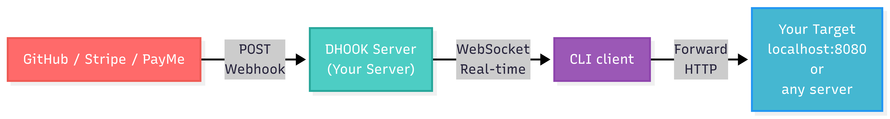

<div align="center">


# DHOOK

**Webhook Relay Service & CLI Tool**

[](https://dart.dev)
[](https://pub.dev/packages/dhook)
[](https://opensource.org/licenses/MIT)
[](https://www.docker.com/)

*Forward webhooks from the cloud to your local development environment in real-time*

</div>

---

## 📖 What is DHOOK?

DHOOK is a lightweight webhook relay service that allows you to receive webhooks (from GitHub, Stripe, PayMe, etc.) on your local machine during development.



## 🚀 Quick Start

### Installation

```bash
# Install globally via pub.dev
dart pub global activate dhook

# Or install from source
dart pub global activate --source git https://github.com/alisheraxmedov/dhook.git
```

### 1. Deploy on Your Server

```bash
# SSH to your server
ssh user@your-server.com

# Clone repository
git clone https://github.com/alisheraxmedov/dhook.git
cd dhook

# Run with Docker
docker-compose up -d
```

### 2. CLI Agent (on your machine)

```bash
# Run the client
dhook client \
  --server wss://your-server.com/ws/my-channel \
  --target http://localhost:8000
```

### 3. Configure Your Webhook

Point your webhook to:
```
https://your-server.com/webhook/my-channel
```

## 🔐 Authentication (Optional)

DHOOK supports API key authentication to secure your channels.

### Enable Auth on Server

```bash
# Start server with authentication
dhook server --port 3000 --auth

# Or with Docker (edit docker-compose.yml command)
command: ["./dhook-server", "server", "--port", "3000", "--auth"]
```

### Create API Key

```bash
curl -X POST https://your-server.com/api/keys \
  -H "Content-Type: application/json" \
  -d '{"channel": "my-channel", "name": "production"}'

# Response:
# {"api_key": "dhk_xxx...", "channel": "my-channel", ...}
```

### Connect with API Key

```bash
dhook client \
  --server wss://your-server.com/ws/my-channel \
  --target http://localhost:8000 \
  --api-key dhk_xxx...
```

## 🐳 Docker Deployment

```bash
# Build and run
docker-compose up -d

# Check logs
docker-compose logs -f

# Stop
docker-compose down
```

## 🛠️ Usage

### Server Commands

```bash
# Start relay server on default port 3000
dhook server

# Start on custom port
dhook server --port 8080

# Start with API key authentication
dhook server --port 3000 --auth
```

### Client Commands

```bash
# Connect to relay and forward to localhost
dhook client \
  --server wss://your-server.com/ws/my-channel \
  --target http://localhost:8000

# With API key authentication
dhook client \
  --server wss://your-server.com/ws/my-channel \
  --target http://localhost:8000 \
  --api-key dhk_your_api_key
```

### API Endpoints

| Endpoint | Method | Description |
|----------|--------|-------------|
| `/` | GET | Health check |
| `/new` | GET | Generate new channel (redirects to /channel/<id>) |
| `/ws/<channel>` | WS | WebSocket connection for CLI |
| `/webhook/<channel>` | ANY | Receive webhooks |
| `/webhook/<channel>/<path>` | ANY | Receive webhooks with subpath |
| `/api/keys` | POST | Create new API key (auth mode) |
| `/api/keys` | GET | List registered channels (auth mode) |

## 📦 Programmatic Usage

```dart
import 'package:dhook/dhook.dart';

// Start a relay server
final server = RelayServer(port: 3000);
await server.start();

// Start with authentication
final authServer = RelayServer(
  port: 3000,
  enableAuth: true,
  apiKeyStoragePath: 'keys.json',
);
await authServer.start();

// Start a CLI agent
final agent = CliAgent(
  serverUrl: 'wss://your-server.com/ws/my-channel',
  targetUrl: 'http://localhost:8000',
  apiKey: 'dhk_xxx...', // optional
);
await agent.start();
```

## 🏗️ Architecture

```
dhook/
├── bin/
│   └── dhook.dart              # CLI entry point
├── lib/
│   ├── dhook.dart              # Library exports
│   └── src/
│       ├── client/
│       │   └── cli_agent.dart        # WebSocket client
│       ├── server/
│       │   ├── relay_server.dart     # HTTP/WebSocket server
│       │   ├── api_key_manager.dart  # API key authentication
│       │   └── rate_limiter.dart     # DoS protection
│       ├── models/
│       │   └── webhook_payload.dart
│       └── utils/
│           └── logger.dart
├── Dockerfile
└── docker-compose.yml
```

## 🔒 Security Features

- **API Key Authentication**: Secure channels with `dhk_` prefixed tokens
- **Rate Limiting**: 100 requests/minute per IP (DoS protection)
- **Body Size Limit**: 1MB max for webhook payloads
- **Cryptographic IDs**: Secure channel ID generation
- **TLS/SSL Support**: Use with Nginx reverse proxy

## 📄 License

MIT License - see [LICENSE](LICENSE) for details.

## 👤 Author

**Alisher Axmedov**
- GitHub: [@alisheraxmedov](https://github.com/alisheraxmedov)
- Email: alisheraxmedov4x4@gmail.com

## 🤝 Contributing

We welcome contributions from the community! If you would like to contribute to this project, please read our [Contributing Guidelines](CONTRIBUTING.md) for detailed instructions on how to get started.

---

<div align="center">

Made with ❤️ in Uzbekistan 🇺🇿

</div>